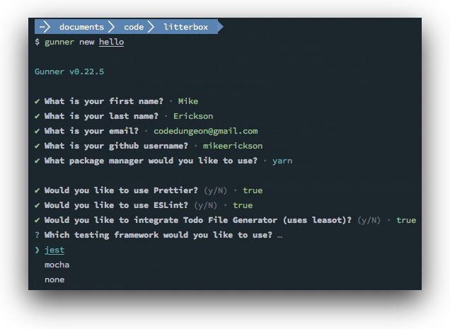
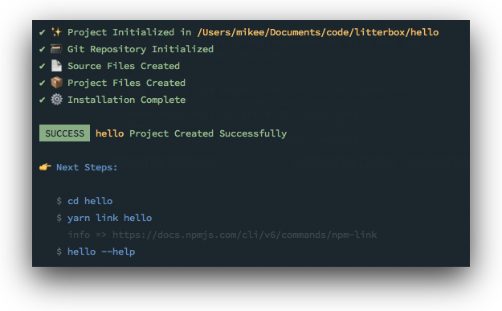

<h4 align="center">
    
</h4>

# Gunner

## Description

Codedungeon Slim CLI Framework

## Installation (Globally)

Use gunner globally to create new CLI projects (using `gunner new...`) or for creating new commands (`gunner make:command xxx`) and extensions (`gunner make:extension xxx`)

Using npm

```bash
> npm install -g @codedungeon/gunner
```

Using yarn

```bash
> yarn add global @codedungeon/gunner
```

## Installation (Project)

When creating new CLI projects which use the gunner CLI engine, you can install gunner into your project as you would other npm modules

Using npm

```bash
> npm install @codedungeon/gunner
```

Using yarn

```bash
> yarn add @codedungeon/gunner
```

## Using Gunner CLI

You can use the Gunner CLI to create new CLI projects

```bash
gunner new <project>
```

You will receive a series of prompts to guide you through the new project creation process

<h4>
    
</h4>

After new project has completed, you will see an installation summary similar to the following which will instruct what needs to happen next.

<h4>
    
</h4>

Change directory to new project to review your new CLI project scaffoled with the gunner starter.

### Create new CLI command

Using the Gunner CLI, you can create new CLI commands as follows

```bash
gunner new:command test --name test
```

A new CLI command will be created in the `src/commands` directory

```js
module.exports = {
  name: 'test',
  description: 'test description',
  disabled: false,
  hidden: false,
  usage: 'Do something cool, after all this is your command!',
  flags: {
    // example flag, adjust accordingly
    name: { aliases: ['n'], description: 'Command name', required: false },
  },
  execute(toolbox) {
    let name = toolbox.strings.titleCase(toolbox.arguments.name || 'world')
    toolbox.print.info(`Hello ${name}`)
  },
}
```

You can see your new CLI command in action by executing

```bash
hello test --name Mike
```

which will print the info

```bash
Hello Mike
```

Now, have a look at the CLI help

```bash
hello --help
```

```bash
🚧 hello v0.0.1 build 1
   Crafted with love by Mike Erickson ((https://github.com/mikeerickson))

Usage:
  hello info --limit 5

Commands:
  say-hello [args]              Say hello to my little friend!
  test [args]                   test description

Options:
  --help, -h, -H                Shows Help (this screen)
  --overwrite, -o               Overwrite Existing Files(s) if creating in command
  --quiet, -q                   Quiet mode (suppress console output)
  --version, -v, -V             Show Version
                                 (includes table of hello options)

Examples:
  hello info --versions 7,8
```

And, you can see command level help using the following example

```bash
hello test --help
```

Will output command help

```bash
🛠  test
   test description

Usage:
  Do something cool, after all this is your command!

Options:
  --name, -n              Command name
```

## Adding Gunner CLI Engine to existing projects

In addition to creating new CLI projects discussed above, you can also add the Gunner CLI Engine to an existing Node based project by installing `@codedungeon/gunner` (see Installation above)

- Create `index.js` file and add the following (showing the bare minimum required)

```js
#!/usr/bin/env node

const { CLI } = require('@codedungeon/gunner')
const pkgInfo = require('./package.json')

const app = new CLI(process.argv, __dirname)
  .usage(`${pkgInfo.packageName} make:command TestCommand --name test:command`)
  .options(/* if not called, options will be suppressed in help dialog */)
  .version(/* version string override, if not supplied default version info will be displayed */)
  .examples(
    /* if not called, examples will be suppressed in help dialog */
    `${pkgInfo.packageName} make:command TestCommand --name hello`
  )
  .run()
```

- Create new command in the `src/commands` directory (you can use the `gunner new:command` to quickly scaffold a new CLI command)

```bash
gunner make:command test --name test --description="test description"
```

- Test you new CLI by executing `node index.js` from the root of your project

```bash
node index.js --help
```

## Gunner API

Refer to `docs/getting-started.md`

Refer to `docs/api.md`

## License

Copyright &copy; 2019-2021 Mike Erickson
Released under the MIT license

## Credits

Gunner written by Mike Erickson

E-Mail: [mike.erickson@codedungeon.io](mailto:mike.erickson@codedungeon.io)

Twitter: [@codedungeon](http://twitter.com/codedungeon)

Website: [codedungeon.io](http://codedungeon.io/gunner)
